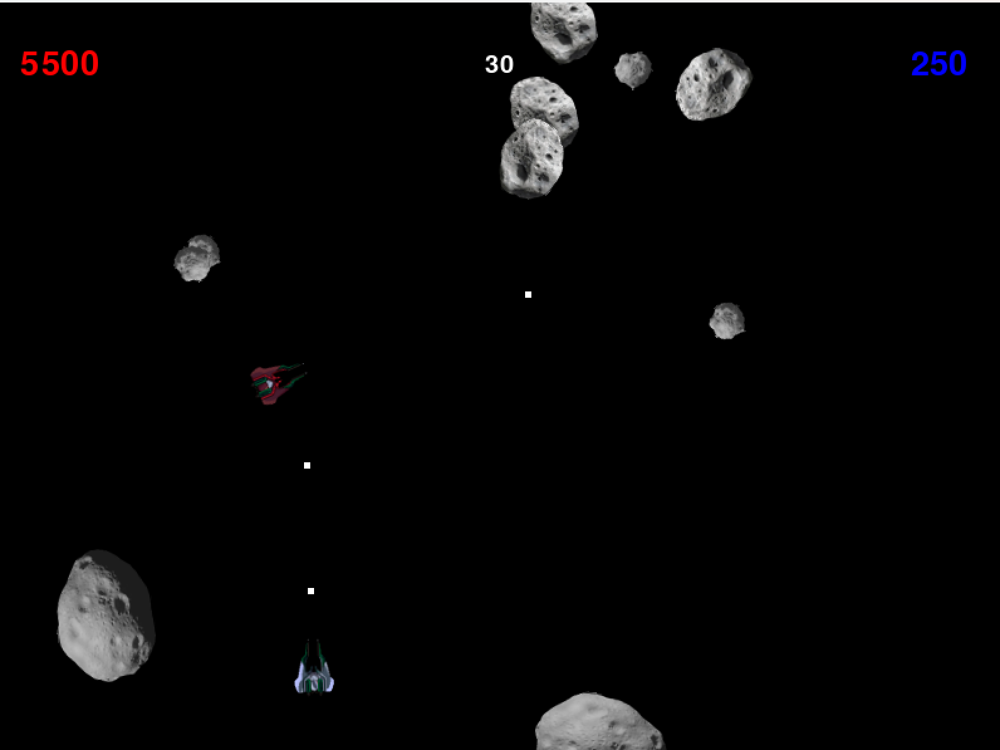

# 1v1-Asteroids

1v1 Asteroid game built with Python, Pygame, and Uvage.

## Description of the Game

A 2-player "Asteroids"-style game in which both players control their own ship and shoot at asteroids while floating in space.

Each player must score as many points as possible within a designated time limit. Hitting asteroids that drift across the screen as well as other targets will earn the player points.

When asteroids are hit, they break into smaller chunks, creating additional obstacles but also more opportunities to score.

Player death (hitting an asteroid or being shot by the other player) results in a respawn timer, during which the surviving player may continue earning points.

At the end of the time interval, the game ends and both point totals are compared to determine the winner. The winning score is compared to the high score stored in a file, and the high score is updated if beaten.

## Basic Features

* **User Input** – The red ship uses the W/A/D keys and shoots with the "1" key. The blue ship uses the Up/Left/Right arrow keys and shoots with the "," key.
* **Game Over** – A game over screen appears at the end of the match. Players can restart the game by pressing "R".
* **Graphics and Images** – Visual assets are used for game information, asteroids, ships, and bullets.

## Additional Features

* **Restart from Game Over** – Press "R" to restart once the game over screen appears.
* **Sprite Animation** – Ships have thruster animations when moving and explosion animations upon destruction.
* **Enemies** – Asteroids act as enemies. Hitting one penalizes the player with a respawn timer and temporary spawn protection upon return.
* **Timer** – A 60-second countdown appears at the top of the screen, showing the remaining time.
* **Two Players Simultaneously** – Each player controls a ship using separate movement and firing controls suited to their spawn location.
